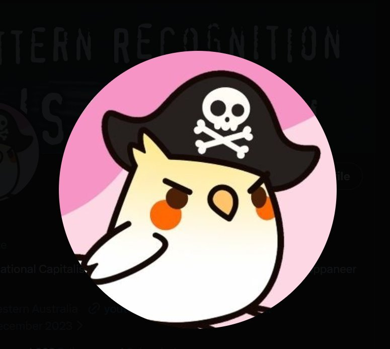

<div align="center">



# 🏴‍☠️ Ren'Py to Godot Converter
# 🄲🄾🄼🄸🄽🄶 🅂🄾🄾🄽

**One-click conversion from Ren'Py visual novels to fully working Godot 4+ projects**

[](https://www.python.org/)
[](https://godotengine.org/)
[](LICENSE)

[Features](#-features) • [Installation](#-installation) • [Usage](#-usage) • [How It Works](#-how-it-works) • [FAQ](#-faq)

</div>

---

## 🎯 What is this?

A **Python tool** that automatically converts Ren'Py visual novel games into fully functional **Godot 4+ projects** with **Dialogic 2** integration. No manual asset copying, no tedious setup - just run one command and open in Godot!

> 🎮 Tested with many games, including **Katawa Shoujo**- 2000+ assets, 25+ characters, fully converted including VFX!
> 🔎 Working on more elaborate Renpy games now to increase the conversion success rate

---

## ✨ Features

| Feature | Description |
|---------|-------------|
| 🗄️ **RPA Extraction** | Automatically extracts `.rpa` archives using rpaExtract.exe |
| 🖼️ **Asset Organization** | Sorts images, audio, video, fonts into proper Godot structure |
| 👤 **Character Generation** | Creates Dialogic character files with portraits auto-detected |
| 📜 **Timeline Creation** | Generates demo Dialogic timeline ready to play |
| 🎮 **Ready to Run** | Output project works immediately in Godot - just press F5! |
| 📦 **Works with Compiled Games** | No `.rpy` source files needed - works with `.rpyc` |

---

## 📦 Installation

### Requirements
- Python 3.8+
- Godot 4.3+ (with Dialogic 2 addon)
- Windows (for rpaExtract.exe)

### Setup
```bash
# Clone the repo
git clone https://github.com/promptpirate-x/renpy-to-godot-converter.git
cd renpy-to-godot-converter

# That's it! No dependencies needed (uses only Python stdlib)
```

---

## 🚀 Usage

### Basic Conversion
```powershell
python convert_full.py "C:\Games\MyRenpyGame" "C:\Projects\MyGodotGame"
```

### Example with Katawa Shoujo
```powershell
python convert_full.py "C:\Games\Katawa-Shoujo" "C:\Projects\KS-Godot"
```

### After Conversion
1. Copy the **Dialogic addon** to `<output>/addons/dialogic/`
2. Open `project.godot` in Godot 4.3+
3. Enable Dialogic plugin in Project Settings → Plugins
4. Press **F5** to run! 🎮

---

## 📁 Output Structure

```
MyGodotGame/
├── 📄 project.godot           # Ready-to-open project file
├── 📁 scenes/
│   └── main.tscn              # Main scene (auto-starts dialogue)
├── 📁 scripts/
│   └── main.gd                # Dialogic launcher script
├── 📁 dialogic/
│   ├── characters/            # Auto-generated .dch files
│   │   ├── emi.dch
│   │   ├── hanako.dch
│   │   └── ...
│   └── timelines/
│       └── demo.dtl           # Demo timeline
└── 📁 assets/
    ├── images/
    │   ├── backgrounds/       # Scene backgrounds
    │   ├── characters/        # Character sprites (organized by char)
    │   ├── cg/                # Event CGs
    │   ├── ui/                # UI elements
    │   └── vfx/               # Visual effects
    ├── audio/
    │   ├── music/             # BGM tracks
    │   └── sfx/               # Sound effects
    ├── video/                 # Video files
    └── fonts/                 # Font files
```

---

## ⚙️ How It Works

```
┌─────────────────┐     ┌─────────────────┐     ┌─────────────────┐
│   Ren'Py Game   │ ──▶ │    Converter    │ ──▶ │  Godot Project  │
│                 │     │                 │     │                 │
│ • .rpa archives │     │ 1. Extract RPA  │     │ • project.godot │
│ • .rpyc scripts │     │ 2. Sort assets  │     │ • Dialogic chars│
│ • Images/Audio  │     │ 3. Gen Dialogic │     │ • Demo timeline │
└─────────────────┘     │ 4. Create proj  │     │ • Sorted assets │
                        └─────────────────┘     └─────────────────┘
```

### Conversion Stages

1. **RPA Extraction** - Uses snapshot method to extract archives
2. **Asset Detection** - Identifies backgrounds, sprites, audio, etc.
3. **Character Discovery** - Finds character folders and portraits
4. **Dialogic Generation** - Creates `.dch` character files with expressions
5. **Timeline Creation** - Generates playable demo dialogue
6. **Project Assembly** - Creates Godot project files with proper config

---

## 🎭 Supported Asset Types

| Ren'Py Folder | → | Godot Destination | Type |
|--------------|---|-------------------|------|
| `bgm/` | → | `assets/audio/music/` | 🎵 Music |
| `bgs/`, `bg/` | → | `assets/images/backgrounds/` | 🖼️ Backgrounds |
| `sprites/` | → | `assets/images/characters/` | 👤 Sprites |
| `event/`, `cg/` | → | `assets/images/cg/` | 🎨 Event CGs |
| `sfx/`, `sound/` | → | `assets/audio/sfx/` | 🔊 Sound FX |
| `ui/`, `gui/` | → | `assets/images/ui/` | 🎛️ UI |
| `video/` | → | `assets/video/` | 🎬 Videos |
| `font/` | → | `assets/fonts/` | 🔤 Fonts |

---

## ❓ FAQ

<details>
<summary><b>Why Godot instead of staying with Ren'Py?</b></summary>

Godot offers more flexibility for custom gameplay, better performance, modern tooling, packaging for console games, and you own your entire pipeline. Plus it's great for learning game dev!
</details>

<details>
<summary><b>Does this convert the actual dialogue/story?</b></summary>

Currently it converts **assets only** and creates a demo timeline. Full `.rpy` script conversion is on the roadmap - PRs welcome!
</details>

<details>
<summary><b>What about games without .rpa files?</b></summary>

It works! The converter will find loose asset files in the game folder directly.
</details>

<details>
<summary><b>Can I use this commercially?</b></summary>

This tool is MIT licensed. However, make sure you have rights to the assets you're converting!
</details>

---

## 🗺️ Roadmap

- [x] RPA archive extraction
- [x] Asset organization
- [x] Dialogic character generation
- [x] Demo timeline creation
- [ ] Full `.rpy` script parsing
- [ ] Dialogue conversion to Dialogic timelines
- [ ] Menu/choice conversion
- [ ] Variable/condition support
- [ ] GUI for non-technical users

---

## 🤝 Contributing

Contributions are welcome! Feel free to:
- 🐛 Report bugs
- 💡 Suggest features
- 🔧 Submit PRs

---

## 📜 License

MIT License - do whatever you want with it! 

---

<div align="center">

**Made with ❤️ by [Prompt Pirate](https://github.com/promptpirate-x)**

</div>
